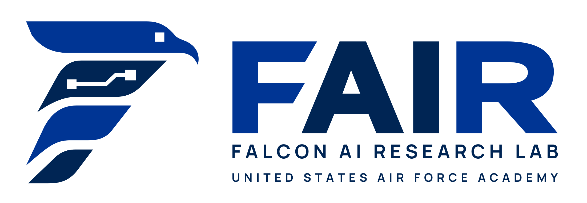

<p align="center">
  
</p>

# FAIR Lab planning

This repository provides automations for creating/documenting tasks for the Falcon AI Research Lab (FAIR). 

Source of truth for all active tasks for the current year: [FAIR Lab Lines of Effort 2026](https://github.com/orgs/USAFA-AI-Center/projects/3).

All work tracking will be contained within the `docs/` directory. 

## How it works

A bot, `fair-logbook`, runs everything from issue and PR comments. Never close an issue by hand.
The bot closes it when it merges the issue's record into `docs/`. A record is the write-up of
the finished work (markdown file generated from the issue's template).

**You do three things**:

1. Write the issue (see below).
2. Fill in the template on the PR the bot opens. Click the edit link, replace the placeholder text, click **Commit changes**.
3. Comment `/done` to hand each step back to the bot.

**Who can run commands.** Only the issue's assignees. The assignee list (right sidebar,
**Assignees**) is how the bot knows who the driver is. A command from anyone else gets a reply
naming who can run it, and nothing happens. On a sub-issue, the parent's assignees count too, so
assigning the driver on the parent covers every period. To let someone cover for the driver, add
them as a second assignee. `/help` works for anyone.

## Writing an issue

Open **New issue → Line of effort**.

**Title.** The title becomes the record path. Settle it before the first record.

**Assignee.** The driver. In this repo the assignee is the driver. Required: the bot ignores
commands from anyone else.

**Labels.**

| Label | Required | Options |
|---|---|---|
| `cadence:` | yes, one | `once`, `weekly`, `monthly`, `quarterly`, `semester`, `annual`, `standing` |
| `kind:` | yes, one | `admin`, `build`, `infra`, `integration`, `report`, `service` |
| `area:` | if it applies | `b200`, `drone`, `fair-llm`, `website` |
| `partner:` | if it applies | the outside party, e.g. `partner:afit` |
| status | if it applies | `needs-scope`, `needs-external-help`, `blocked`, `faculty-lecture` |

**Body.**

```
**Notes:** context, links
**Doc:** _the bot fills this in_
**Done means:** what has to exist for this to be finished
```

**Record template (optional).** Comment `/template` on the issue. The bot adds the default
template to the issue body, required fields already in place. Edit its sections to fit the work.
Every record for this issue is generated from it. Leave the `**Issue:**` line and the `{{...}}`
fields as they are. Skip this and the bot uses the default.

## One-off work (`cadence:once`)

1. Write the issue.
2. When the work is finished, comment `/done` on the issue. The bot opens a PR and replies with an edit link.
3. Fill in the template on the PR: click the edit link, replace the placeholder text, click **Commit changes**.
4. Comment `/done` on the PR. The bot merges it, closes the issue, and marks it Done.

Record: `docs/Make_FAIR_Lab_logo.md` (the issue title, spaces as underscores).

## Recurring work (`cadence:weekly`, `monthly`, `quarterly`, `semester`, `annual`)

The parent issue never closes. Each period is a sub-issue with its own record.

1. Write the parent issue.
2. Comment `/schedule 2026-10 2027-05` on the parent. The bot creates one sub-issue per period, with due dates on the board.
3. When a period's work is finished, comment `/done` on its sub-issue.
4. Fill in the template on the PR, then comment `/done` on the PR.

Records: `docs/Set_up_and_manage_monthly_Faculty_Coaching_Seminars/2026-10.md`, one per period.

Periods: `2026-W40`, `2026-10`, `2026-Q4`, `2026-fall` / `2027-spring`, `2026`.

## Standing responsibilities (`cadence:standing`)

The issue never closes. Each discrete change (a rebuild, an incident, a move) is a sub-issue with
its own record.

1. Write the issue.
2. When a change happens, comment `/change GPU rebuild` on the issue. The bot files the sub-issue.
3. When the change is done, comment `/done` on the sub-issue.
4. Fill in the template on the PR, then comment `/done` on the PR.

Records: `docs/B200_Management/2026-09-25_GPU_rebuild.md`, one per change.

## Commands

| Where | Comment | Does |
|---|---|---|
| recurring issue | `/schedule <first> [<last>]` | creates the sub-issues; re-run to extend |
| one-off issue or sub-issue | `/done` | opens the record PR |
| recurring issue | `/done <period>` | opens that period's record PR |
| standing issue | `/change <short name>` | files one change as a sub-issue |
| one-off or recurring issue | `/template` | copies the record template into the issue to edit |
| record PR | `/done` | checks the record and merges it |
| anywhere | `/help` | lists the commands |

## Templates

A record is generated from the `## Template` block in the issue body, added by `/template`. A
sub-issue uses its parent's. `**Template:** #N` in the body borrows another issue's template. With
neither, the bot uses the default.

## The check

Every PR runs `check`. A PR that closes an issue must add that issue's record, written, with its
`**Issue:** #N` line. `main` accepts nothing else.

## Maintainers

`bin/logbook` is the bot. `.github/workflows/bot.yml` runs it with the App's token. It also runs
locally as you:

```
bin/logbook schedule <issue#> --start <period> (--count N | --until <period>)
bin/logbook template <issue#> [--set]
bin/logbook doc <issue#> [--set]
bin/logbook check [--pr <PR#>]
```

The App needs Contents, Issues, and Pull requests (read/write), Metadata (read), and organization
Projects (read/write). Its ID is in the variable `LOGBOOK_APP_ID`, its key in the secret `LOGBOOK_APP_KEY`.

## Labels

- `kind:` type of work, exactly one
- `cadence:` `once`, `weekly`, `monthly`, `quarterly`, `semester`, `annual`, `standing`
- `area:` shared dependency: website, b200, fair-llm, drone
- `partner:` outside party that has to show up
- `needs-scope`, `needs-external-help`, `blocked`
- `faculty-lecture` present the tool at a coaching seminar when it ships
- `recurrence` one period or change, made by `/schedule` or `/change`

## Board fields

- **Assignees** the driver
- **Doc** where its records live; the bot writes it
- **Priority**, **Target date** set by the driver and the lab lead
